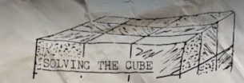
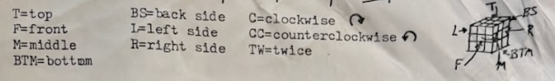
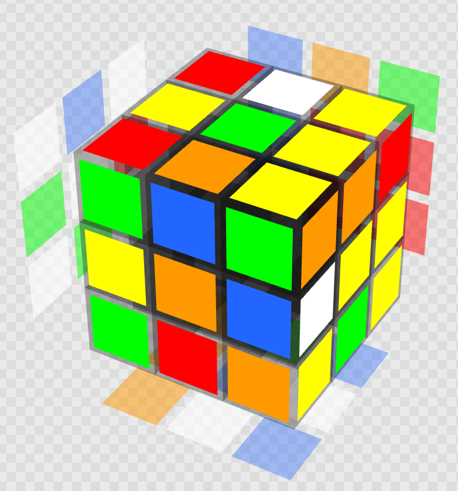
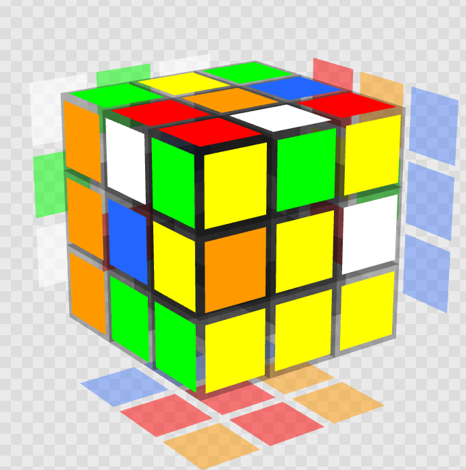
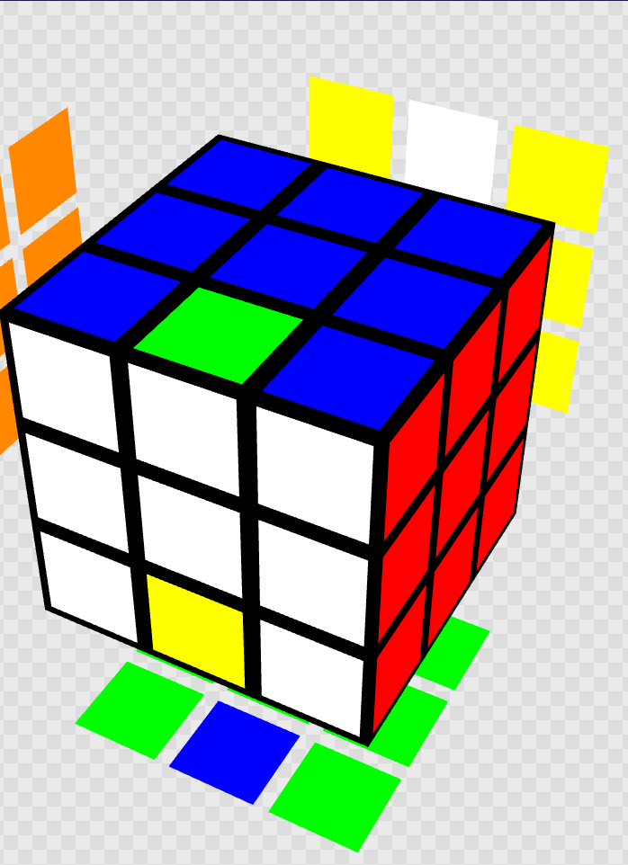
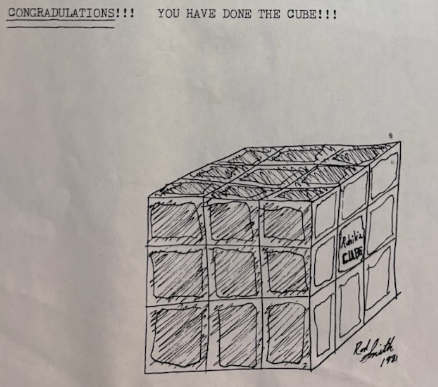

# SOLVING THE CUBE

- *Created by: Rodney Smith 1981*
- *Updated by: Gabriel Smith 2025*

---

<!-- START doctoc generated TOC please keep comment here to allow auto update -->
<!-- DON'T EDIT THIS SECTION, INSTEAD RE-RUN doctoc TO UPDATE -->
**Table of Contents**

- [Forward](#forward)
- [The Original](#the-original)
- [Key](#key)
- [I. Complete one side](#i-complete-one-side)
- [II. Position opposite corners](#ii-position-opposite-corners)
- [III. Color-Align opposite corners](#iii-color-align-opposite-corners)
- [IV. Complete Second side](#iv-complete-second-side)
- [V. Recomplete first side](#v-recomplete-first-side)
- [VI. Small Hill](#vi-small-hill)
- [VII. Big Hill](#vii-big-hill)
- [CONGRADULATTONS!!! YOU HAVE DONE THE CUBE](#congradulattons-you-have-done-the-cube)
- [Example Scramble and Solve](#example-scramble-and-solve)
- [The Condensed Version](#the-condensed-version)
- [Concepts](#concepts)
  - [Channel Lock](#channel-lock)

<!-- END doctoc generated TOC please keep comment here to allow auto update -->

## Forward

> "I came up with figuring it out in High School (1981) and determined to write
> it down for myself.
> Sort of a nerd/geek at the time. Lol
> Led me into business and process documentation. Go figure.
> ~ Rodney

Somewhere between 12 and 14, I came across my dad's writeup of how he solved the
Rubik's cube. He might have shown it to me, or I might've just found it
somewhere. I know we talked about it, and he explained it to me. I remember
memorizing the algorithms and solving the cube on long road trips to
grandparents.

Here I am, 15+ years later, buying speed cubes and sharing the method with
friends. I don't expect world records or anything. But it's nice that my dad's
method, that he came up with intuitively, is still the core of my approach on
everything 2x2 up to 5x5, and even hypercubes (2^4). And I see no reason it
can't extend to higher order cubes. I just haven't bought them yet.

So here is a somewhat modernized version.

## The Original

Before I do anything else: [The Original](./RSmithRubiksMethod.pdf) version,
committed to paper.

Moving forward, I will update and add my commentary, but I want to preserve the
original. It's impressive to me that my dad was able to come up with a
consistent method and write it down prior to internet. And this is the method
that I learned and have been using consistently for 15+ years now.

## Key

> I have modernized the steps to utilize the modern notation, as cataloged
> [here](https://solvethecube.com/notation). But here is my dad's legend anyway.

I have converted slice rotations to a single `E/M/S`, instead of a `F' f` or
equivalent.

## I. Complete one side

No steps provided.

---

My dad's definition of solved was:

- Correct is based on the center tile
- All corners on a side are correct (positioning and orientation)
- 3 Edges are correct (positioning and orientation)
- Remaining edge doesn't matter; this is a keyhole for later use.

I later consolidated the steps by only solving the corners:

## II. Position opposite corners

A. Place completed side on `B`.  
B. Check for positioned corners on `F`.  
C. Positioning  

  1. If 2 are not positioned, then place them on `FD`.
  2. If all 4 are not positioned, then just do the maneuver.
  3. Do this maneuver of moves if any are not positioned:
      `U' F U L' U L U' F2`
  4. Check for positioned corners on `F`.
  5. Repeat until all corners are positioned

---

This algorithm also cycles the orientation of the corners, so it should be done
first.

I've personally found that this works best when the cube is rotated so that your
first side in your left hand, and the side in progress is on the right.

From that orientation, the moves become:
`U' R U F' U F U'`

Triggers are:

- If 2 are correct on a shared side, put them on `T`
- Otherwise; repeat until two are positioned correctly.

I have simplified to remove extra `F2` moves that realigned the face between
each execution. This is not needed. You can realign the face `R/R'` or `x/x'` as
needed to achieve the trigger positions.

## III. Color-Align opposite corners

A. Place completed side on `B`.  
B. Check for color-aligned corners on `F`.  
C. Color-aligning  

  1. If 1 corner is color-aligned, then place corner in the `FTR` corner.
  2. If 2 corners are color-aligned & not together, then place 1 of them in `FTR`.
     - > This is the diagonal corner case
  3. If 2 corners are color-aligned & together, then place on `FL`.
  4. If 0 corners are color-aligned, then just do the maneuver.
     - > I have found that this often is a `headlights` case. If that's true,
       > place them on the `FR` side.
  5. Do this maneuver of moves if all corners are not color-aligned.
      `U' F2 U F U' F U`
  6. Check for color-aligned corners on `F`.
  7. Repeat until all corners are oriented.

---

Once again, I like to side-align on `L/R`. Algorithm becomes:
`U' R2 U R U' R U`

Triggers are: (Ordered list, first is priority)

- Singles `FRU`
- Line `FL`
- Headlights to `R`
- Treat Diagonals as Singles
- None: YOLO

Again, you can either `R/R'` or `x/x'` to position them.

## IV. Complete Second side

A. Place first side on `U`.  
B. Do Guide & Storage.  

---

Oddly enough, this isn't defined. But this is the point of that key hole left
on the first layer.

In my head, I state this as "Position your two correct sides on `L` and `R`".
You are now free to use `U/U'` to open up the edge location, and `M/M'` slice
moves to get pieces in. The "hardest" pieces are the last two, but it's not
really that difficult.

Here, I just finish the edges of the first 2 faces.

This is an intuitive step without special algorithms. I'm sure it can be
optimized more.

## V. Recomplete first side

A. Place first side on `U`.
B. Put cube that goes on `U` in `FRM` with `U` color on `R`.
C. Do the following maneuver of moves.  
  `F' E' F E F E' F' E`

---

This step can be easily handled in the previous step.  It also assumes that the
parity of the last edge is correct, which it's possible to have reversed.

## VI. Small Hill

A. Check for positioned side pieces.  
B. If no side piece is positioned, then do maneuver,  
C. Place positioned side piece in `BD` with the 2 completed sides on `L`&  `R`.  
D. If `F` & `D` piece goes in `B` & `U`, then do maneuver.  
E. If not, then flip the cube over by trading `L` & `R`, and do A. over again.  
F. Do this maneuver of moves if pieces are not positioned  
   `L R' F2 L' R T2`
G. If the pieces are not positioned, then do A. again,

---

This is a 3 piece cycle of edge pieces. With the orientation I use, I am moving
the `FD` -> `BU` -> `FU`.

I use a shorter expression of the algorithm:
`M' U2 M U2`

## VII. Big Hill

A. Check for color-aligned side pieces.
B. If 6 side pieces are color-aligned, then Just do the maneuver.
C. If 2 are color-aligned and not on same side, then place 1 color-aligned piece
   in `B` & `D`.
D2 If 2 are color-aligned and on the same side, then place the 2 not
   color-aligned on `U`,
E. Do this maneuver of moves 1f not color-aligned.
   `L R' F' x L R' F' x L R' F2 L' R U' x' L' R U' x' L' R U2`
F. If not complete then do A. again,

---

At this stage, you have everything in position. The only orientation problems
are in the `M` ring around the center of the cube.

To resolve them:

- Put a pair of pieces to reorient on `U`. One should be `F` and the other `B`
  - If the the pieces are on diagonals, then `F2` to put them both on
    `U`.
- `x' (M' U)3 U2 (M U)3 U`
  - If you had to do an `F2` to allign the pieces, it can be undone here with
    another `F2`
  - You can do the `U` as `U'`, but you must do the same direction through the
    whole algorithm.

## CONGRADULATTONS!!! YOU HAVE DONE THE CUBE

---

I offer no notes, I'm 100% certain this is the correct spelling, as it's from
the source material.

## Example Scramble and Solve

I don't claim to be the best, or optimal. I just wanted to step through a solve
as an example.

[Scramble and Solve in Twizzle Alpha](https://alpha.twizzle.net/edit/?alg=%2F%2F+Setup%3A+White+to+front.%0Ax%27%0A%0A%2F%2F+Face+1%3A+White+Corners%0AR+B%27+R+U+B%27+D%27+R%27+D+B+R%27+U%27+R%0A%0A%2F%2F+Face+2%3A+Yellow+Corner+Positions%0Ax2+F%27+y%27+%2F%2F+Move+the+two+correct+to+the+top%2C+then+reorient.%0AU%27+R+U+F%27+U+F+U%27+%2F%2F+Positioning+Algorithm%0AR2+%2F%2F+Align+the+corners+with+their+Partners%0A%0A%2F%2F+Face+2%3A+Yellow+Corner+Orientation%0Ax+%2F%2F+Headlights+right+of+face%2C+correct+facing+left+of+face%0AU%27+R2+U+R+U%27+R+U+%2F%2F+Orientation+Algorithm.%0Ax+%2F%2F+Headlights+to+the+right+of+face.%0AU%27+R2+U+R+U%27+R+U+%2F%2F+Repeat%0Ax%27+%2F%2F+Put+the+single+correct+in+UR+of+face.%0AU%27+R2+U+R+U%27+R+U+%2F%2F+Repeat%0AR+%2F%2F+Align+to+Opposite+Face%0A%0A%2F%2F+Faces+1+and+2%3A+Edges.%0AB+M%27+B%27+%2F%2F+Solve+White+Red%0AU+M+U%27+%2F%2F+Yellow+Green%0AF+M%27+F%27+R2+F+M+F%27+R2+%2F%2F+Store+the+Red+Yellow%2C+then+put+it+in+place.%0AF+M+F%27+R+F+M%27+F%27+R%27+%2F%2F+Yellow+Blue%0Ax+%2F%2F+Move+the+channel+to+the+top.%0AL2+U%27+M%27+U+L%27+U%27+M+U+L%27+U+M2+U%27+L%27+M+U%27+M2+U+L+%2F%2F+Solve+the+remaining+edges.%0A%0A%2F%2F+Remaining+Edge+Positions%0Az2+%2F%2F+Posiition+for+placement.%0AM%27+U2+M+U2+%2F%2F+3+cycle+to+put+Red+Green+in+place.%0A%0A%2F%2F+Remaining+Edge+Orientation%0A%28M%27+U%293+U+%28M+U%293+U&setup-alg=%2F%2F+Scramble%0AF%27+U%27+F+B%27+L+F%27+B2+D+B%27+R+L2+F2+U2+D%27+R2+D2+L2+F2+L2+D+R2)

> I updated this as I went, and some of the steps got desynced. But it still is
> a full solve.

## The Condensed Version

- SFC (Solve First Corners)
  - Solve the corners of your first side. Position and Orientation.
  - Once complete, place on `L`.
- PLC (Position Last Corners)
  - The Maneuver: `U' F U L' U L U'`
  - Use position cues to orient cube pre-alg until all corners are in the
    correct positions.
- OLC (Orient Last Corners)
  - `F' E' F E F E' F' E`
  - Use position cues to orient the cube pre-alg until all corners are oriented.
- Channel Lock F2E (First 2-layer Edges)
  - No Alg; Intuitive. Use the `S` layer and `U/U'` to get your opposing faces
    solved.
- PFE (Position Final Edges)
  - Small Hill: `M' U2 M U2`
  - Feel free to rotate `x'` freely. `y2` and `z2` are also fine.
  - This is a position only.
- OFE (Orient Final Edges)
  - Big Hill: `x' (M' U)3 U (M U)3 U`
  - You can do a `F2/B2` setup to put the edges on the top

## Concepts

### Channel Lock

With the corners solved, you can orient the cube so your safe sides are on `L`
and `R`.

This creates a safe channel around the `M` slice that you can use to manipulate
the edge pieces. Combined with turns of one side (I prefer `T`), you can freely
rotate orientation and modify position of edges. Then, you can lock them into
place, maintaining the `M` channel for further use.
